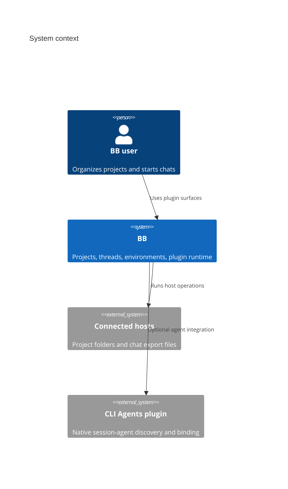
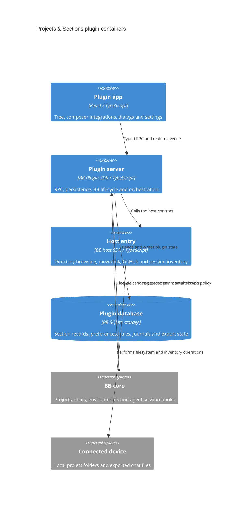
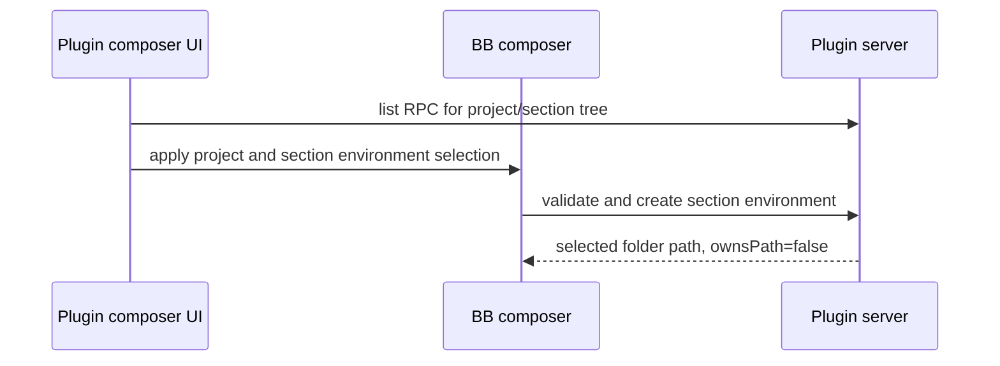
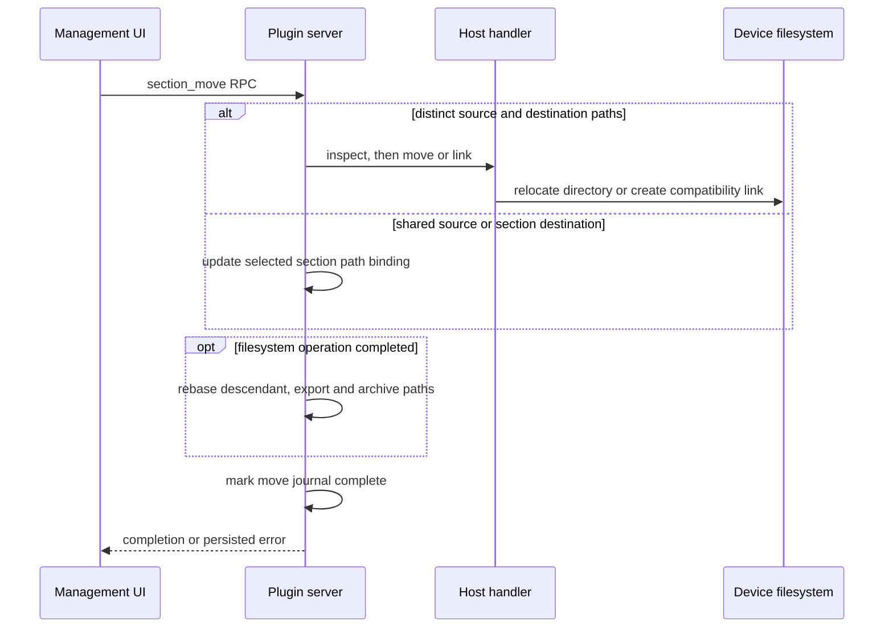

# Architecture

TL;DR: The React app calls the server through typed BB RPC; the server coordinates BB projects, threads, environments and storage, and dispatches filesystem-specific work to host handlers on connected devices (`server.ts:3359-3382`, `host.ts:7-16`).

## System Context

## Containers

## Building Blocks

- `app.tsx` composes the sidebar thread list, management page, composer extensions and settings sections (`app.tsx:1-70`). Its capabilities are covered by [the feature pages](features/project-tree.md).
- `server.ts` defines RPC schemas and handlers, initializes storage, integrates BB SDK lifecycle APIs and registers the CLI command (`server.ts:187-602`, `server.ts:631-718`, `server.ts:3390-3475`). See [API](api.md).
- `host.ts` binds the host contract to filesystem, move/link, GitHub remote and session inventory handlers (`host.ts:7-16`).
- State modules divide domain behavior: `archive.ts`, `project-move.ts`, `section-move.ts`, `thread-move.ts`, `execution.ts`, `session-policy.ts`, `session-policy-server.ts`, `preferences.ts` and `chat-list.ts` (`server.ts:1-44`).
- `export-queue.ts` coalesces queued history exports, runs one at a time and retries failures (`export-queue.ts:1-63`).

### Plugin initialization

1. `plugin(bb)` declares legacy rule-setting descriptors for migration, opens BB’s SQLite storage, and applies the plugin schema migrations for tree rows, rule records, move/archive/export state and preferences (`server.ts:631-718`).
2. It reads the migrated shared agent settings from `preferences`; if absent, it reads the legacy BB settings, validates each known value against its schema, stores the result, and logs a warning if legacy settings cannot be read (`server.ts:719-776`).
3. It defines the database-backed tree and rules helpers and constructs the move/archive/export subsystems; those helpers become dependencies of the RPC handlers (`server.ts:777-1003`, `server.ts:1884-1890`, `server.ts:3263-3305`).
4. It registers the main RPC contract and separate read-only section-list contract, then configures BB agent instructions and CLI commands (`server.ts:3359-3382`, `server.ts:3383-3407`, `server.ts:3537-3632`).
5. Runtime integrations branch on BB capabilities: session policy enforcement is registered only when the experimental hook exists; unsupported/absent capability leaves stored policy available but unenforced (`session-policy-server.ts:52-68`, `session-policy-server.ts:144-150`).

| Initialization branch | Condition | Outcome/failure |
|---|---|---|
| Legacy settings migration | No `preferences` row under `agents` | Attempts read, logs failure, validates defaults/values and stores one shared record (`server.ts:743-776`). |
| Existing settings | `agents` row exists | Parses saved JSON into defaults plus schema-valid values (`server.ts:743-764`). |
| Session-policy extension | BB provides `experimental_vkSessionPolicy` | Installs the resolver; otherwise capability is reported unavailable and no hook is installed (`session-policy-server.ts:52-68`, `session-policy-server.ts:144-150`). |
| RPC registration | Plugin initialization reaches registrations | Registers the main handlers and discoverable read-only section-list contract (`server.ts:3359-3382`). |

## Key Flows

### Start a chat in a section

The registered section environment checks that the selected section exists, belongs to the chosen project, is not a group, has a folder binding on the selected host, and is not moving or being archived (`server.ts:3485-3522`).

### Move a section

For distinct paths, the move implementation checks relevant chats, records a journal before filesystem changes, drains pending exports, rechecks/stops chats, and updates folder, export and archive paths in a transaction; failures remain retryable. If the source path is shared or the destination already belongs to a section, it updates only the selected section’s path binding and completes the journal without a filesystem operation (`section-move.ts:186-241`, `section-move.ts:268-353`).

### Project relocation coordinator

`makeProjectMoves` creates a move journal reader/writer, a `busy` predicate for incomplete records and a `canonical` path mapper that follows up to 100 completed relocations. A single in-memory `running` flag serializes move attempts (`project-move.ts:18-46`).

1. `move` rejects a concurrent attempt, finds the BB project and local source on the selected host, then resumes an incomplete move only when host and destination match; otherwise it creates a new journal candidate (`project-move.ts:47-80`).
2. It rejects overlapping source/destination ownership by another project, other-project environments inside the source, this project’s environments outside it, and unfinished archive operations. The host `inspect` call validates the paths before any journal barrier is recorded (`project-move.ts:81-139`).
3. It pages through archived and active threads and refuses active/starting/stopping/pending states, queued work or positive activity. Once clear, it persists the journal barrier, publishes the change, drains pending exports and rechecks/stops threads admitted during preflight (`project-move.ts:140-171`).
4. It asks the host to move the folder, updates the BB source path, rebases archive manifests, folder paths and export paths, then commits the path updates and `complete=true` in a database transaction (`project-move.ts:172-233`).
5. On a failure after journal persistence, it stores the error and publishes a change before rethrowing. `finally` always releases the in-memory running guard (`project-move.ts:234-243`).

| Branch | Condition | Result |
|---|---|---|
| Busy | Another move is running | Rejects before project lookup (`project-move.ts:47-54`). |
| Retry | Incomplete journal matches host and destination | Reuses its original paths; a different destination/host is rejected (`project-move.ts:62-80`). |
| Preflight failure | Ownership, environment, archive, host path or thread checks fail | Rejects; if a journal already exists, records the error and preserves it for retry (`project-move.ts:81-171`, `project-move.ts:234-240`). |
| Complete | Host move and metadata updates succeed | Marks journal complete, clears error and returns it (`project-move.ts:172-233`). |
| Path canonicalization limit | More than 100 completed move links would be followed | Throws “Too many project relocation links” (`project-move.ts:34-44`). |

### Archive a section

The archive module inventories matching chats and files, saves chat exports, records an `archiving` journal, archives chats and moves files unless the section points outside the project, then removes tree/path rows and marks the record `archived`; operation failures keep the journal with an error (`archive.ts:119-240`, `archive.ts:322-375`).

## Invariants

- A group stores a synthetic path that is not a filesystem path (`server.ts:2152-2178`, `section-tree.ts:8-11`).
- Section environment selection must match project and host and rejects groups or folders covered by an active move/archive (`server.ts:3485-3509`).
- Project, section and chat moves persist operation state so retries can resume without overwriting occupied destinations (`project-move.ts:26-31`, `section-move.ts:268-293`, `section-move.ts:243-266`, `thread-move.ts:108-136`).
- Chat history in BB remains canonical; exported files are snapshots written beneath the section folder (`server.ts:1770-1783`, `server.ts:1829-1839`).
- Session-context enforcement registers only when BB exposes the experimental extension (`session-policy-server.ts:52-68`, `session-policy-server.ts:144-150`).

## Cross-cutting concerns

RPC input/output shapes are Zod-backed contracts registered with BB’s plugin RPC service (`server.ts:187-621`, `server.ts:3359-3382`). The server publishes `changed` after state updates (`server.ts:1570`); the host entry separates device-specific operations from the central server (`host.ts:7-16`). Move and archive errors are persisted in journals; history export records errors and retries through a queue (`section-move.ts:347-353`, `archive.ts:371-375`, `export-queue.ts:27-45`).

<!-- lane-pilot:backlinks -->
## Referenced by

- [Projects & Sections — Overview](overview.md)
