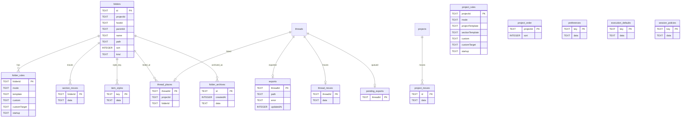

# Data model

TL;DR: The plugin stores a normalized section tree plus JSON settings and operation journals in BB’s SQLite plugin database; BB remains the owner of projects, threads, environments and canonical chat history (`server.ts:684-718`, `server.ts:1770-1783`).

## Schema overview

The lines below show logical relations encoded by IDs and JSON payloads. The migration creates primary keys and a uniqueness constraint on section paths, but declares no SQL foreign-key constraints (`server.ts:684-718`).

Project and thread IDs in these tables point to BB-owned entities; the BB records are not plugin-created tables (`server.ts:684-718`).

## Archive store coordinator

`makeArchives` owns reads and writes for `folder_archives`, serializes archive/restore operations, and provides predicates used by other features. Archive manifests are JSON stored in the row’s `data`; the public archive and restore sequence is described in [Section archive and restore](features/archive-and-restore.md) (`archive.ts:50-72`, `archive.ts:96-118`).

1. Construction captures the database and callbacks for current folders, canonical paths, project-move checks, project roots, export sync/drain and change notifications (`archive.ts:50-62`).
2. `list` reads records newest-first, parses JSON and validates each manifest; `put` inserts or replaces a record by ID and creation timestamp (`archive.ts:63-72`).
3. `matches` searches only completed archived records for the same project/host, comparing the saved name or path basename after trimming and Unicode NFC/case normalization. `blocked` checks whether a chat ID is listed in any archive; `moving` checks paths under an archive not yet in `archived` state after optional canonicalization (`archive.ts:73-95`).
4. `serial` runs each asynchronous archive operation after the preceding one. A rejected operation rejects its caller, while the internal queue catches the rejection so later operations still run (`archive.ts:96-101`). Thread inventory separately pages both archived states in batches of 200 until a short page is returned (`archive.ts:102-117`).

| Branch/helper | Condition | Result or failure |
|---|---|---|
| Manifest listing | Any stored row | JSON parse or schema validation can fail; valid records return in descending `createdAt` order (`archive.ts:63-68`). |
| Name matching | Project and host match and record is `archived` | Returns name/basename matches using trimmed NFC, locale-lowercase comparison (`archive.ts:75-86`). |
| Chat blocking | Chat ID occurs in an archive manifest’s `threadIds` | Returns true regardless of archive state (`archive.ts:87-88`). |
| Path blocking | Record is not in `archived` state and canonicalized path is under its folder path | Returns true; completed archives do not block (`archive.ts:89-95`). |
| Serialized operation | Previous queue operation succeeded or failed | Runs the new operation; its own error is returned to caller, but does not poison later queue entries (`archive.ts:96-101`). |

The coordinator receives no cleanup policy for completed rows here; restore/delete lifecycle is owned by the archive operations page (`archive.ts:332-345`, `archive.ts:402-430`).

## Tables

All table declarations and primary keys are in the plugin migration (`server.ts:684-718`). `data` columns contain JSON described by the owning domain types.

### `folders`

Purpose: Section and group tree nodes for BB projects.

| Field | Meaning | Key / constraint |
|---|---|---|
| `id` | Plugin UUID for this node | Primary key |
| `projectId` | Owning BB project ID | Logical project reference |
| `hostId` | Connected BB host where the folder exists | Logical host reference |
| `parentId` | Parent section/group; `NULL` for project root child | Logical self-reference |
| `name` | Tree label | — |
| `path` | Absolute host path for folder; synthetic `@group/<id>` for group | Unique with `projectId`, `hostId` |
| `sort` | Sibling ordering integer | Default `0` |
| `kind` | `folder` or `group` | Default `folder` |

Writers: section creation, group creation, move/repath, archive restore and reorder handlers (`server.ts:1640-1672`, `server.ts:2100-2120`, `section-move.ts:294-309`, `archive.ts:402-419`). Readers: tree/list, section environment validation, move/archive logic and appearance rules (`server.ts:778-790`, `server.ts:3328-3362`, `archive.ts:63-95`).

### `folder_rules`

Purpose: Per-section rules mode and template configuration.

| Field | Meaning | Key / allowed values |
|---|---|---|
| `folderId` | Section node owning rules | Primary key / logical `folders.id` |
| `mode` | File handling mode | `manual`, `inherit`, `custom` |
| `template` | Section template text | UTF-8 text, max 20,000 at RPC |
| `custom` | Individual rules text | UTF-8 text |
| `customTarget` | Where custom text goes | `file`, `session`, `both`; default `file` |
| `startup` | One-time first-message text | UTF-8 text, max 4,000 at RPC |

Writers/readers: rules settings handlers store/read by `folderId`; apply/startup paths read the row (`server.ts:886-898`, `server.ts:2760-2800`, `server.ts:1630-1740`).

Mode lifecycle (the same transition behavior applies to `project_rules.mode`):

| From | To | Function and condition |
|---|---|---|
| absent or any saved mode | `manual` | `rules_settings_save` saves the selection and performs no template-file write (`server.ts:2758-2797`) |
| absent or any saved mode | `inherit` | Saves mode; updates/removes file custom rules while the stored template continues to resolve through inheritance (`server.ts:886-912`, `server.ts:2758-2800`, `server.ts:2817-2821`) |
| absent or any saved mode | `custom` | Saves mode and stamps the selected template/custom blocks (`server.ts:2758-2816`) |

### `project_rules`

Purpose: Project-root rules plus project and section template defaults.

| Field | Meaning | Key / allowed values |
|---|---|---|
| `projectId` | Owning BB project | Primary key |
| `mode` | File handling mode | `manual`, `inherit`, `custom` |
| `projectTemplate` | Project-root template text | UTF-8 text, max 20,000 |
| `sectionTemplate` | Default section template | UTF-8 text, max 20,000 |
| `custom` | Project-specific rules | UTF-8 text |
| `customTarget` | Where custom text goes | `file`, `session`, `both`; default `file` |
| `startup` | One-time first-message text | UTF-8 text, max 4,000 |

Writers/readers: project rules settings handlers and inherited template/rule resolvers (`server.ts:900-912`, `server.ts:2760-2800`, `server.ts:1630-1740`).

### `project_order`

Purpose: Persist ordering of project rows.

| Field | Meaning | Key / allowed values |
|---|---|---|
| `projectId` | BB project ID | Primary key |
| `sort` | Zero-based display order | Integer |

Writers: `reorder` handler; readers: project tree loader (`server.ts:1358-1384`, `server.ts:2971-2977`).

### `preferences`

Purpose: Shared UI preferences and migrated global agent settings.

| Field | Meaning | Key / allowed values |
|---|---|---|
| `key` | Record family | `ui` for current UI preferences; `agents` for legacy migrated settings |
| `data` | JSON preference payload | Parsed/validated by the relevant schema |

Writers: preference save and legacy migration; readers: preferences and rule configuration loaders (`server.ts:748-760`, `server.ts:3168-3201`). UI fields and defaults are defined in `preferences.ts:66-115`.

### `item_styles`

Purpose: Per-project and per-section appearance, sort and chat-limit overrides.

| Field | Meaning | Key / allowed values |
|---|---|---|
| `key` | Item identity | `p:<projectId>` or `f:<folderId>` |
| `data` | JSON style object | Icon, color, fill, cascade, sort, limit |

Writers: `prefs_save` bulk replacement and `item_style_save`; readers: app appearance resolver (`server.ts:3170-3211`, `preferences.ts:53-64`, `appearance.tsx:439-447`).

### `thread_places`

Purpose: Manual tree filing for a chat when its working directory differs from the desired list location.

| Field | Meaning | Key / allowed values |
|---|---|---|
| `threadId` | BB thread ID | Primary key |
| `projectId` | BB project containing the thread | Logical reference |
| `folderId` | Section ID; `NULL` means project root | Logical `folders.id` |

Writers: `thread_place`; readers: list response and chat tree association (`server.ts:1960-1973`, `server.ts:2140-2165`, `chat-list.ts:251-263`). Stale `folderId` rows are removed by cleanup (`server.ts:2282-2317`).

### `execution_defaults`

Purpose: Per-scope new-chat defaults for model, permission mode and native agent.

| Field | Meaning | Key / allowed values |
|---|---|---|
| `key` | Scope key | `g`, `p:<projectId>`, `f:<folderId>` |
| `data` | JSON `Execution` payload | Provider/model, reasoning, service tier, permissions, agent pin |

Writers/readers: execution save/read functions; project/folder cleanup removes matching keys (`server.ts:1012-1025`, `server.ts:1897-1909`). Payload constraints and enum values: `execution.ts:13-55`.

### `session_policies`

Purpose: Per-scope filters and switches for agent session context.

| Field | Meaning | Key / allowed values |
|---|---|---|
| `key` | Scope key | `g`, `p:<projectId>`, `f:<folderId>` |
| `data` | JSON session policy | Four filters and three optional switches; filters `all`, `allow`, `deny` |

Writers: session policy save deletes empty payloads or upserts normalized JSON; readers: editor and per-thread core resolver (`session-policy-server.ts:70-95`, `session-policy-server.ts:102-150`). Schema and limits: `session-policy.ts:16-30`, `session-policy.ts:62-79`.

### `folder_archives`

Purpose: Archive manifests for section subtrees and chat IDs.

| Field | Meaning | Key / allowed values |
|---|---|---|
| `id` | Archive UUID | Primary key |
| `createdAt` | Creation time in Unix milliseconds | Integer |
| `data` | JSON archive manifest | Folder, members, original/archive paths, thread IDs, state, error, external flag |

State lifecycle:

| From | To | Function and condition |
|---|---|---|
| absent | `archiving` | `archive` saves the journal after preflight and chat sync (`archive.ts:219-240`) |
| `archiving` | `archived` | Files/chats complete and tree rows are removed (`archive.ts:332-340`) |
| `archiving` | `archiving` + error | Any operation failure stores its message for retry (`archive.ts:341-345`) |
| `archived` | `restoring` | `restore` begins a restore operation (`archive.ts:349-391`) |
| `restoring` | removed | Restore completes and deletes the archive row (`archive.ts:409-423`) |
| `restoring` | `restoring` + error | Failed restore stores the error and leaves the journal retryable (`archive.ts:424-428`) |

Writers/readers: `makeArchives` writes and parses manifests; project/section moves rebase paths; project deletion removes owned manifests (`archive.ts:63-72`, `project-move.ts:123-145`, `server.ts:1913-1921`).

### `project_moves`

Purpose: Retry journal for project-root relocation.

| Field | Meaning | Key / allowed values |
|---|---|---|
| `id` | Move journal ID | Primary key |
| `data` | JSON project move | Project/host, source/destination, completion and error details |

State-like lifecycle: journal absent → persisted incomplete move → complete on metadata rebase; failures retain the journal and error (`project-move.ts:18-31`, `project-move.ts:200-240`, `project-move.ts:228-246`). Writers/readers: project move module; project deletion removes matching journals (`server.ts:1915-1922`).

### `section_moves`

Purpose: Retry journal for section folder moves and relinks.

| Field | Meaning | Key / allowed values |
|---|---|---|
| `folderId` | Section being moved | Primary key / logical `folders.id` |
| `data` | JSON move record | Source/destination, completion and error details |

State-like lifecycle: a metadata-only shared-path update writes a completed journal with the path binding; a filesystem move writes an incomplete journal before draining exports, then marks it complete after descendant paths, exports and archive manifests are rebased. A failure after journal creation stores an error for retry (`section-move.ts:227-241`, `section-move.ts:268-273`, `section-move.ts:294-353`). Writers/readers: section move module; project move and project cleanup read/remove journals (`server.ts:1924-1932`).

### `thread_moves`

Purpose: Chat environment and dedicated storage relocation journal.

| Field | Meaning | Key / allowed values |
|---|---|---|
| `threadId` | BB chat being moved | Primary key |
| `data` | JSON chat move job | Source/destination, host, project and optional `asked` timestamp in Unix milliseconds |

State-like lifecycle:

| From | To | Function and condition |
|---|---|---|
| absent | journal without `asked` | `move` persists before changing environment/files (`thread-move.ts:108-121`) |
| journal without `asked` | deleted | Core switches directory and storage move completes (`thread-move.ts:138-185`) |
| journal without `asked` | journal with `asked` | Core update fails; agent request is sent (`thread-move.ts:144-168`) |
| journal with `asked` | deleted, moved | `finish` sees destination environment after the request turn and moves chat storage (`thread-move.ts:228-269`) |
| journal with `asked` | deleted, kept | Agent turn ends without the destination environment (`thread-move.ts:243-246`) |

Writers/readers: thread move module; thread dispatch barriers and project/section move checks also inspect it (`thread-move.ts:48-64`, `thread-move.ts:118-168`, `server.ts:1884-1890`).

### `exports`

Purpose: Last chat export path or persisted error.

| Field | Meaning | Key / allowed values |
|---|---|---|
| `threadId` | BB thread ID | Primary key |
| `path` | Current export directory | Absolute host path or `NULL` on error |
| `error` | Last export error | `NULL` on success, error text on failure |
| `updatedAt` | Last state update, Unix milliseconds | Integer |

State lifecycle: success stores a path and `error=NULL`; a non-transient export error stores `path=NULL` and an error; deleted threads remove the row; error rows older than one hour are pruned during `list` (`server.ts:1840-1844`, `server.ts:1866-1877`, `server.ts:2282-2289`). Writers/readers: export pipeline and move modules that rebase paths (`server.ts:1752-1849`, `section-move.ts:310-317`).

### `pending_exports`

Purpose: Durable queue of chat IDs awaiting automatic export after a plugin reload.

| Field | Meaning | Key / allowed values |
|---|---|---|
| `threadId` | BB thread awaiting export | Primary key |

Writers: lifecycle enqueue inserts an ID; queue settlement deletes it. Startup reads and resumes rows (`server.ts:3280-3305`). Readers: server startup queue restoration (`server.ts:3280-3305`).

## Invariants

- Folder uniqueness is `(projectId, hostId, path)`; group paths are synthetic and must not be treated as disk paths (`server.ts:686`, `server.ts:2100-2117`).
- There are no SQL foreign-key constraints; handlers clean dependent records when projects, folders or threads are removed (`server.ts:684-718`, `server.ts:1897-1932`, `server.ts:2282-2317`).
- Scope keys are shared across execution and session policy: `g`, `p:<projectId>`, `f:<folderId>` (`server.ts:713-716`, `session-policy-server.ts:70-75`).
- BB owns canonical thread history; the export tables track file snapshots and outcomes only (`server.ts:1770-1783`, `server.ts:1840-1844`).

## Retention and cleanup

- Export errors older than the configured threshold are deleted; thread placements whose folder no longer exists are removed, and BB thread existence is checked (`server.ts:2282-2317`).
- Project deletion removes its folders, ordering, placements, rules, item style, execution defaults, matching archives and move journals (`server.ts:1897-1932`).
- Automatic export pending IDs persist so the server can restore queued work on startup; successful/settled work removes the pending row (`server.ts:3280-3305`).
- Completed archive records remain available for restore until that restore deletes the record (`archive.ts:332-345`, `archive.ts:402-430`).

## Related pages

- [Section archive and restore](features/archive-and-restore.md)
- [Device copies and moves](features/devices-and-moves.md)
- [Chat history export](features/chat-history-export.md)
- [Execution defaults](features/execution-settings.md)
- [Session context](features/session-context.md)

<!-- lane-pilot:backlinks -->
## Referenced by

- [Projects & Sections — Overview](overview.md)
